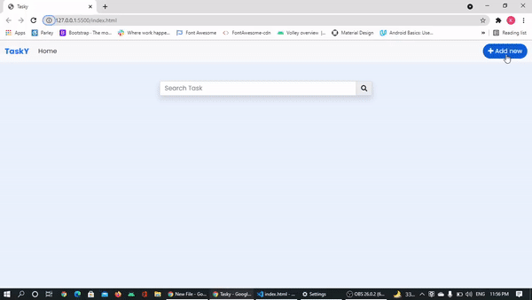

# Tasky
Task management is an essential part of work projects —and for most of our personal lives too. Some people may think that it is just controlling their daily to-dos with checklists. But no.

Since your tasks are the building blocks of plans, projects, and whatever necessary to keep life in order, managing them requires a few steps. The main steps are tracking, adding deadlines and delegation, when it comes to collaboration inside teams.

That’s why notebooks, pens, or even spreadsheets aren’t enough for more complex contexts anymore. These are too simple solutions when you need to collaborate with other people or organize your to-dos in a way you can easily track their progress.

Tasky is built specifically for the purpose of improving your experience while managing your to-dos, and they are essential for people who want to organize your work and enhance your productivity.

# DEMO
A demo video how to use tasky can be seen here 



# TECH STACK
- HTML5
- CSS
- Bootstrap
- Javascript

# Links to Useful Resources
## Fonts
Get fonts from [Google Fonts](https://fonts.google.com/)
```html
<link
    href="https://fonts.googleapis.com/css?family=Poppins:100,100italic,200,200italic,300,300italic,regular,italic,500,500italic,600,600italic,700,700italic,800,800italic,900,900italic"
    rel="stylesheet">
```
## jsDelivr
When you only need to include Bootstrap’s compiled CSS or JS, you can use [jsDelivr](https://www.jsdelivr.com/).
```html
<!-- CSS only -->
<link href="https://cdn.jsdelivr.net/npm/bootstrap@5.0.2/dist/css/bootstrap.min.css" rel="stylesheet" integrity="sha384-EVSTQN3/azprG1Anm3QDgpJLIm9Nao0Yz1ztcQTwFspd3yD65VohhpuuCOmLASjC" crossorigin="anonymous">
```
```html
<!-- JavaScript Bundle with Popper -->
<script src="https://cdn.jsdelivr.net/npm/bootstrap@5.0.2/dist/js/bootstrap.bundle.min.js" integrity="sha384-MrcW6ZMFYlzcLA8Nl+NtUVF0sA7MsXsP1UyJoMp4YLEuNSfAP+JcXn/tWtIaxVXM" crossorigin="anonymous"></script>
```
## Icons
Get icons from [Font Awesome](https://fontawesome.com/)

FontAwesome-CDN
```html
<link rel="stylesheet" href="https://cdnjs.cloudflare.com/ajax/libs/font-awesome/5.15.3/css/all.min.css"
    integrity="sha512-iBBXm8fW90+nuLcSKlbmrPcLa0OT92xO1BIsZ+ywDWZCvqsWgccV3gFoRBv0z+8dLJgyAHIhR35VZc2oM/gI1w=="
    crossorigin="anonymous" referrerpolicy="no-referrer" />
```
